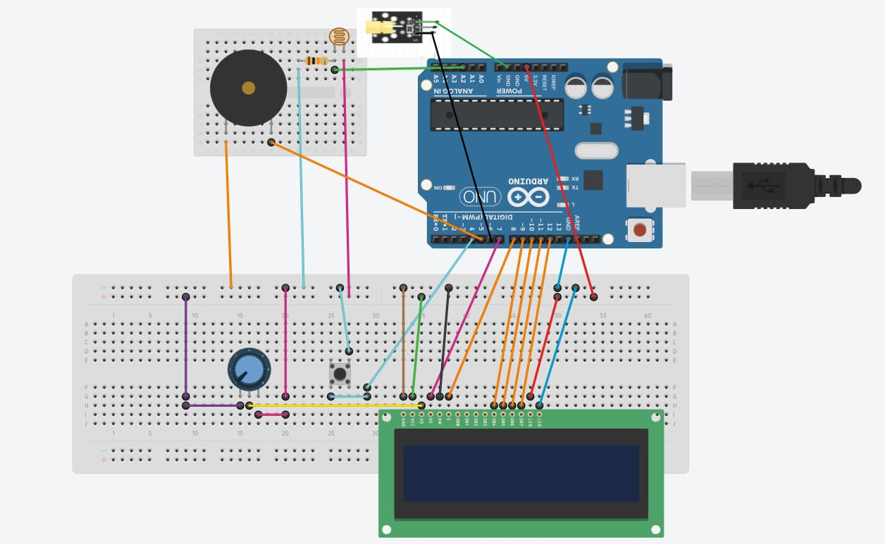
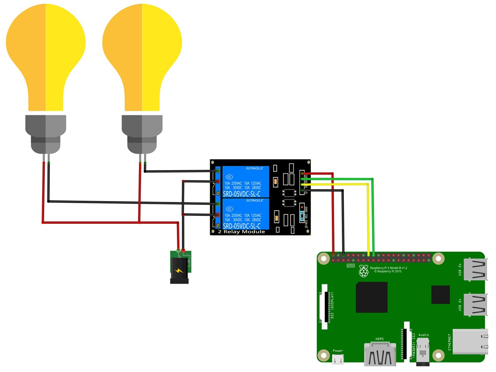

# :bulb:HAS-AS
- For sure many of you were always fascinated about the idea of controlling electric appliances over internet using your phones or other electronic gadgets rather than using the old traditional wall switches.
- **HAS-AS** is just the thing for you to get started with IoT and learn to control electronic appliances using your phones or other electronic gadgets.
- **HAS-AS** is a simple **Home Automation** solution to turn on or off simple appliances, with an integrated **Laser Tripwire Alarm System** system designed to detect intrusion.


## Working

- Let's start with the working of the **Laser Tripwire Alarm System**
  - The Alarm system uses a traditional laser module, an LDR, a buzzer, a 16x2 LCD Display and to carry out the function an Arduino (Any Arduino will work fine).
    - An **LDR or Light Dependent Resistor** changes it's resistance value depending on the level of light, which can be used as an input device to the arduino to read, and detect the light levels. In simple words it is used to detect light levels.
    - The laser acts as an invisible tripwire which when blocked alters the light level falling on the **LDR** which causes the **Alarm System** to activate.
    - The **Arduino** is the main part of this system, it reads the light level from the **LDR** and turns on the alarm if the laser light is blocked, which could mean that an intruder has broken in.
    - The **LCD Display** is used to display the state of the **Alarm System**.  


    
- Let's check the working of the **Home Automation System**
  - This system uses a Raspberry Pi and few Relays that's it, that's the beauty of using a Raspberry Pi, minimal components when compared to an Arduino version and limitless possibilities.
  - We will be looking at two ways to control the GPIO pins on the Raspberry Pi, one using Flask and the other using Blynk.
    - We will be hosting a webpage on the Pi using a software called Flask. Flask is simple python micro web framework which we will be using to host our control page, and allow us to control some protocols. To learn more on Flask click [here](https://flask.palletsprojects.com/en/1.1.x/).
    - We will also be using a python module called RPi.GPIO to control the GPIO pins of the Raspberry Pi. To learn more about the module click [here](https://pythonhosted.org/RPIO/).
    - We will also be using Blynk to control the GPIO pins on the Pi. Blynk is a platform used to control IoT hardware remotely over the internet. To learn more about Blynk click [here](https://docs.blynk.cc/).  
    - Since the power supply on single board computers like Raspberry Pi or on microcontrollers like Arduino cannot be enough to power high current devices or AC appliances, we use **Relays** to help us with that. **Relays** are basically electrically operated switches with their own isolated power supply. They can be controlled just like an LED.


## Parts Required

- For Laser Alarm System : 
  - An Arduino (any one is fine)
  - An LDR
  - A buzzer
  - 16x2 LCD Display
  - Potentiometer(for controlling the contrast of the display, you can skip this part and just use a resistor if you want)
  - Laser module
  - Jumper wires
  - Breadboard
  - 10K ohms resistor

- For Home Automation System : 
  - A Raspberry Pi
  - Relays
  - Jumper wires
  - Wires used in household wirings
  

## Building

---

### Laser Tripwire Alarm System


First lets start with building the alarm system.

- Connect the the components according to the circuit diagram.

    


  The pins of the LCD display are connected to the arduino in the following manner: 
    1. VSS/GND ==>  GND
    2. VCC     ==>  5v
    3. VEE     ==>  Potentiometer
    4. RS      ==>  D7
    5. RW      ==>  GND
    6. E       ==>  D8
    7. DB0     ==>  NOTHING  
    8. DB1     ==>  NOTHING
    9. DB2     ==>  NOTHING
    10. DB3    ==>  NOTHING
    11. DB4    ==>  D9
    12. DB5    ==>  D10
    13. DB6    ==>  D11
    14. DB7    ==>  D12
    15. LED+   ==>  5V
    16. LED-   ==>  GND

    After the circuit is complete you can continue with uploading the sketch.

  - Download Arduino IDE from [here](https://www.arduino.cc/en/software).
  - Clone this repo or just download the **Alarm_System.ino** file.
  - Open the sketch **Alarm_System.ino** using the IDE.
  - Select your board and proper port from the **Tools** menu.(To know to which port is the arduino connected to, use Device Manager on Windows or use `dmesg` command on linux)
  - Click on upload.
  - And you are done!!! Your **Laser Tripwire Alarm System** should now be working.  
 
 
 
### Home Automation with Raspberry Pi


- First download **RaspbianOS** for your Pi from [here](https://www.raspberrypi.org/software/operating-systems/).
- Download **balenaEtcher** from [here](https://www.balena.io/etcher/).
- Download **SD Card Formatter** from [here](https://www.sdcard.org/downloads/formatter/).
- Format your microSD card using SD Card Formatter and flash the RaspbianOS using **balenaEtcher** onto the SD Card. 
- Plug the SD card into the Pi and boot it.
  (You can find guides online for further assistance)

- Now, connect the relays according to the circuit diagram. 
     

---
*****Let's first configure the Blynk app to control the relays*****

- Download the Blynk app from the Play Store or the App Store.
- Select **New Project**.
- Now type in any name you want, Under **Choose Device** select your Raspberry Pi.(For Raspberry Pi Zero, select Raspberry Pi 3B, as there's no option for RPi Zero).
- Now you get an empty space, click on the plus icon on the top and select a **button**. Click on it and select the GPIO pin to which one of the relay is connected to, and make sure to put the **Mode** to **Switch**.
- Repeat the process for the rest of the Relays.
- Now click on the gear icon on the top get the Auth token, keep it aside we'll need it later.

- Lets now install the required softwares to access the Pi using the Blynk app:
  - First of all, you need to install Node.js. Before that we need to remove older versions of Node.js
    ```
    sudo apt-get purge node nodejs node.js -y
    sudo apt-get autoremove
    ```
  - Next run the following commands to install Node.js
    ```
    curl -sL https://deb.nodesource.com/setup_6.x | sudo -E bash -
    sudo apt-get update && sudo apt-get upgrade
    sudo apt-get install build-essential nodejs -y
    ```
    Check the installation with `npm -v` and `node --version` 
  - Now install Blynk
    ```
    sudo npm install blynk-library -g
    sudo npm install onoff -g
    ```
  - Now run default Blynk client. Replace ***YourAuthToken*** with the auth token you obtain before.
    ```
    export PATH=$PATH:/opt/nodejs/bin/
    unset NODE_PATH
    blynk-client YourAuthToken
    ```
  - Now on your Blynk app click on the play icon on the top, now should now be able to turn the lights on and off. 
    
---

*****Now let's setup the Flask server to control the relays*****

- Clone this repo and place RPi folder somewhere safe.
- Now open the file `app.py` and edit the pins section if you used different pins, you can also add additional pins in this section.
- Now run the `app.py` file.
- Now on your other device open the browser and enter the IP address of the Pi.(Use `ifconfig` on Pi to know the IP address).

**Voila, now you can control the lights in your home while sitting on the couch.**

---
- You can run the script on start-up so you dont have to type in the commands to run the script. Refer [this](https://www.dexterindustries.com/howto/run-a-program-on-your-raspberry-pi-at-startup/) to know how.

  
     
 
